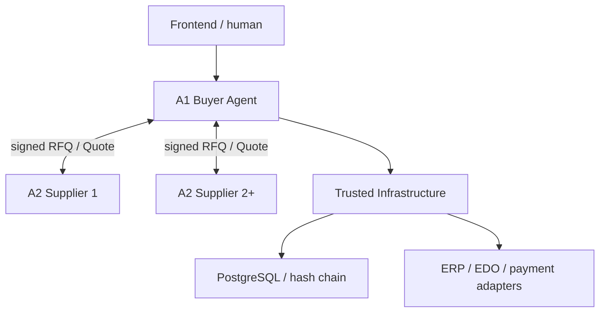
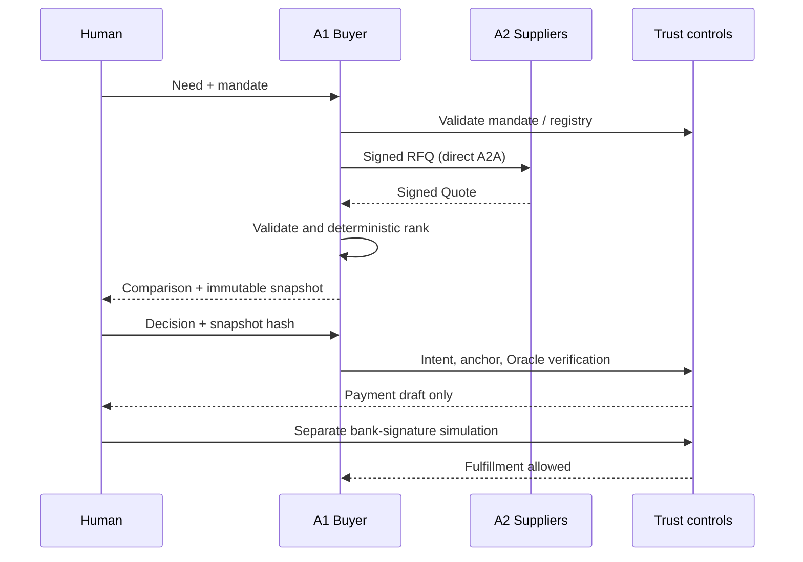
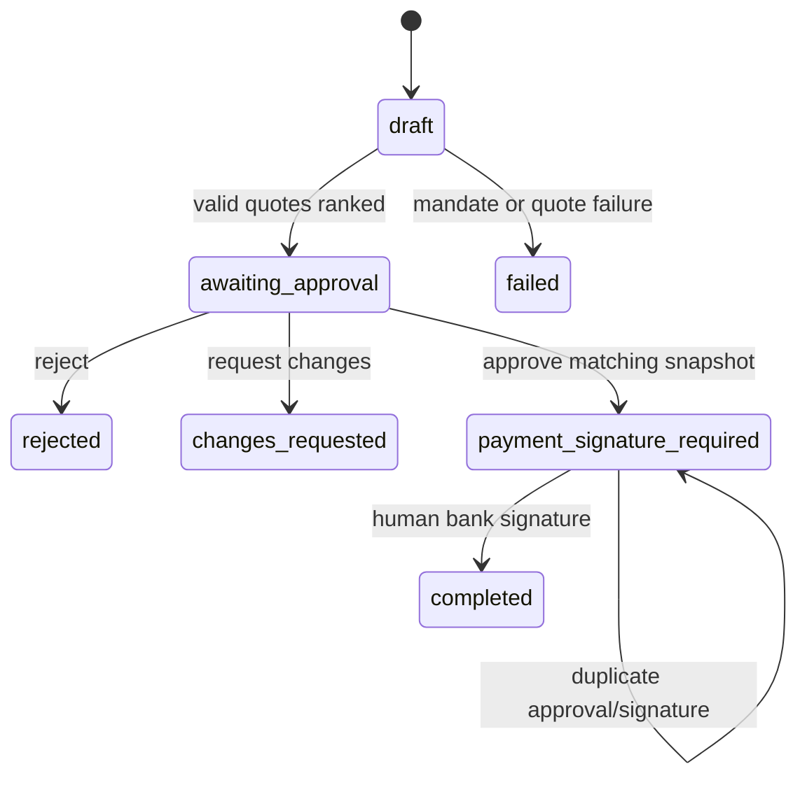

# Target architecture

## Decision

A1 владеет потребностью, discovery, прямым A2A RFQ, deterministic validation/ranking
и представлением результата человеку. A2 владеет каталогом и Quote. Trusted
Infrastructure только проверяет полномочия, риск и юридически значимые переходы.

Нет узла A3. Trusted Infrastructure не выбирает Quote и не ведёт переговоры.

## Process boundaries

| Process | Responsibility | Forbidden authority |
|---|---|---|
| A1 | need, registry query, signed RFQ, validation, ranking, UI | execute payment, autonomous contract signature |
| A2.N | own catalog/inventory, signed Quote | buyer approval, payment |
| Trust API | registry view, readiness, ledger integrity | negotiation, supplier selection |
| Trust modules | mandate/policy/fraud/approval/intent/oracle/draft | changing ranking or offer |
| Model Gateway | optional parsing/explanation | any legal/financial decision |

Trusted modules currently share code and database as a modular monolith. A1 invokes
the control application service in-process; the separate Trust API exposes registry
and ledger verification. Replacing that call with an authenticated port is the next
extraction step and does not change domain contracts.

## Dependency rule

`API/adapters → application → domain`. Domain models do not import FastAPI,
SQLAlchemy, A2A SDK, LangChain or a database implementation.

## Purchase sequence

## Deal state

## Trust boundaries and data flow

- Browser input, A2 messages, Agent Cards, documents and LLM output are untrusted.
- SignedEnvelope uses canonical JSON, payload SHA-256 and replaceable Ed25519 provider.
- Agent endpoints pass centralized scheme/port/DNS/IP validation; redirects are disabled.
- Payment recipient comes from Registry binding hash, never free-form Quote text.
- PostgreSQL ledger events are an append-only hash chain, explicitly not a blockchain.
- Tenant enforcement is partial in this MVP; production OIDC/BFF and row-level object
  authorization remain mandatory before real data.
